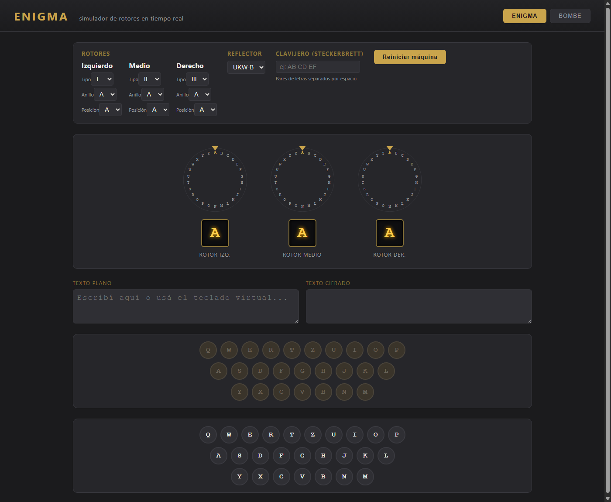
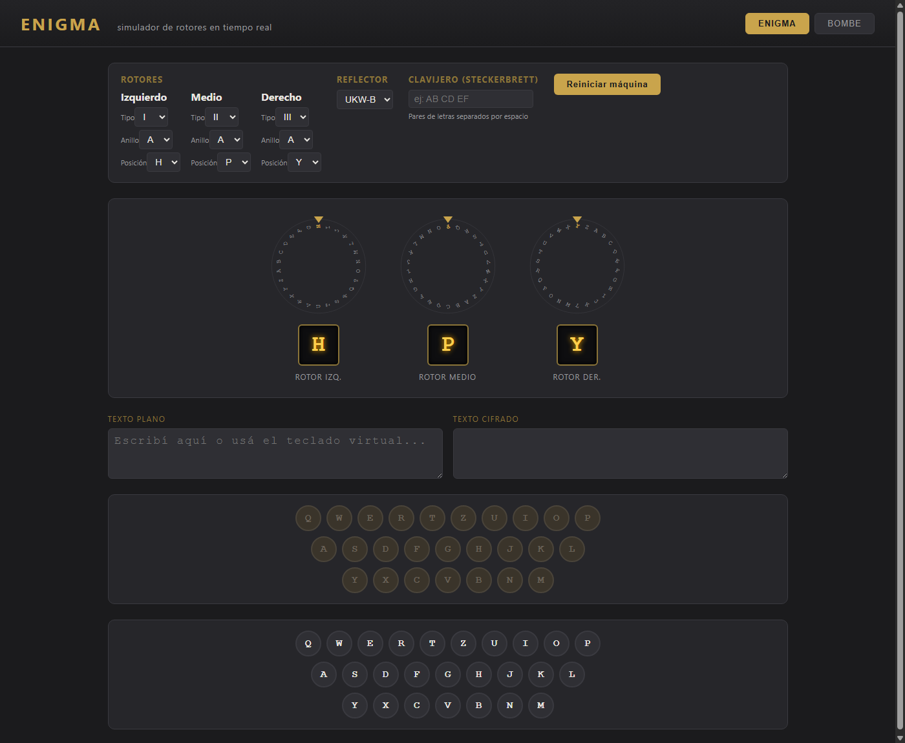
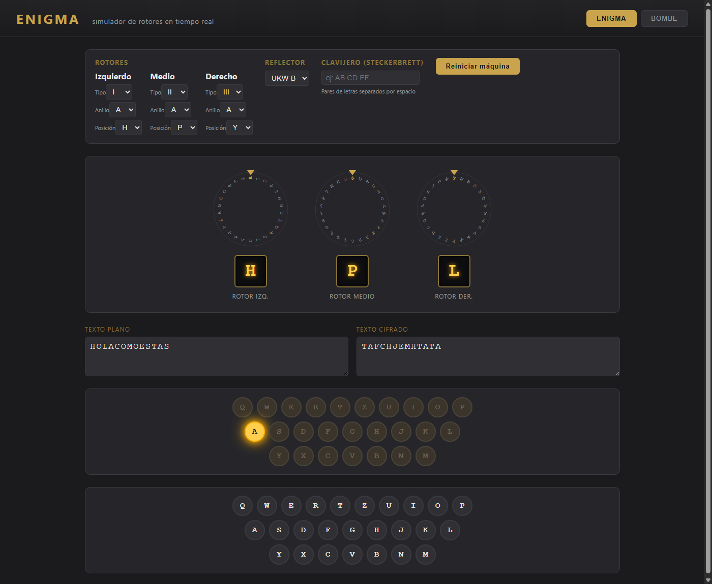
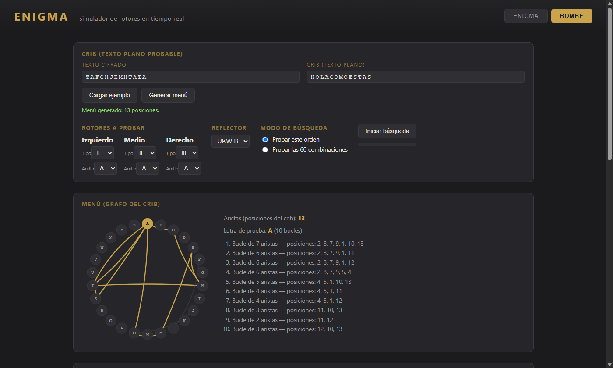
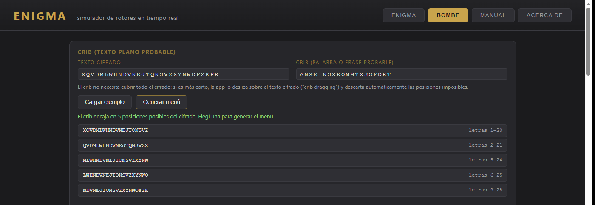
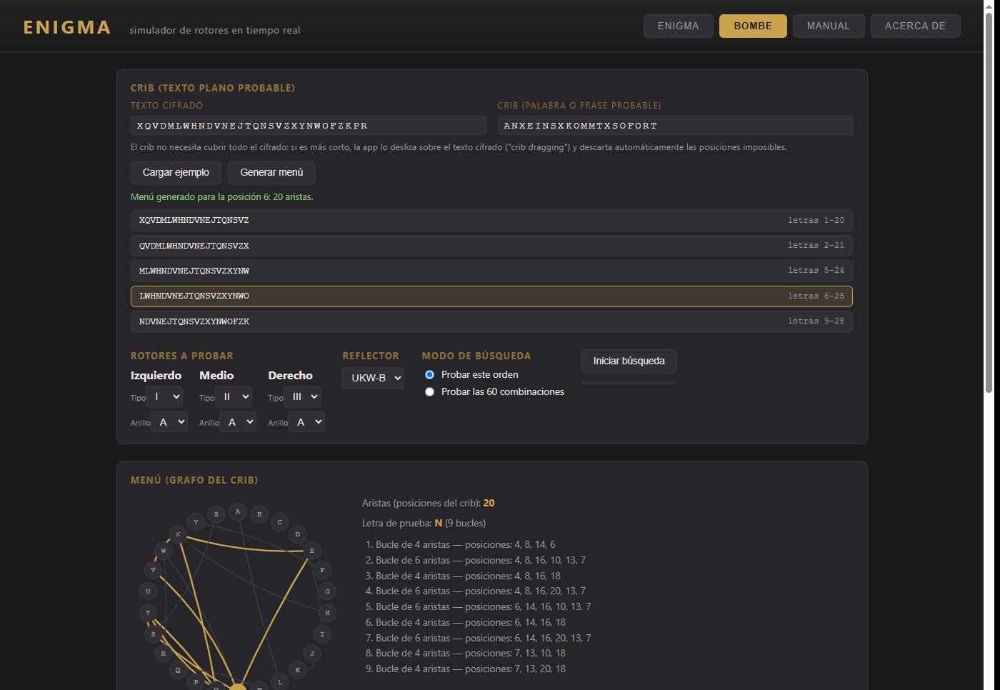
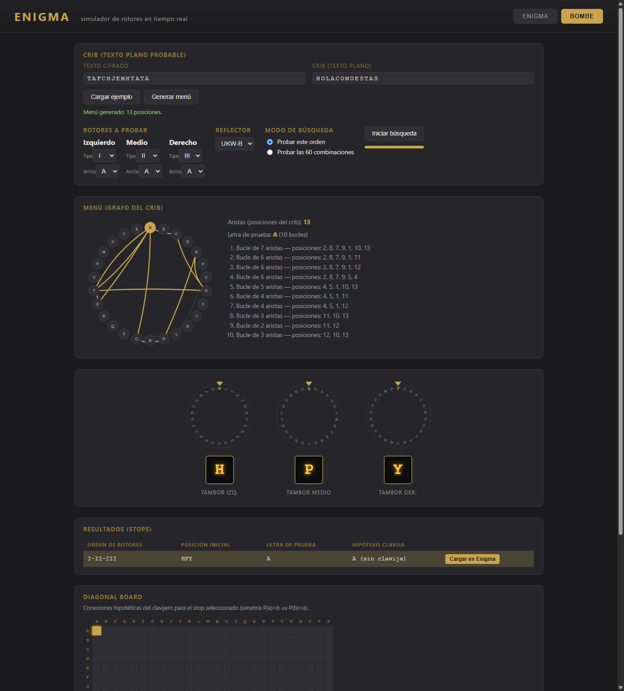
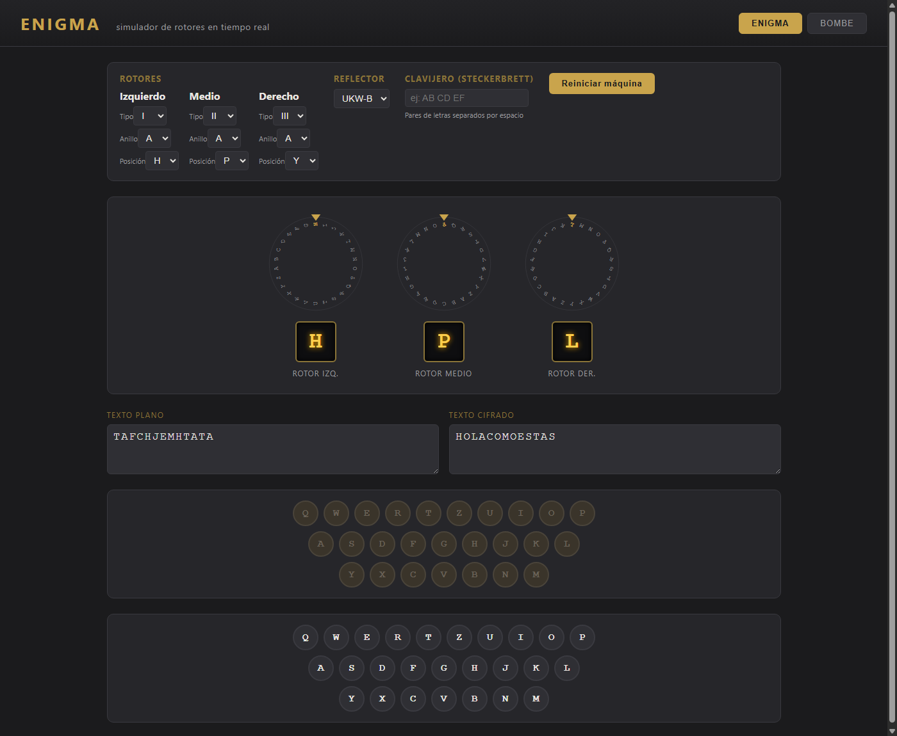

# Manual paso a paso: de "HOLA COMO ESTAS" a la Bombe... y de vuelta

Este manual muestra, con capturas de pantalla reales del simulador, el
**circuito completo** de un mensaje:

1. Se cifra `HOLA COMO ESTAS` con la máquina **Enigma**, usando una
   configuración secreta de rotores.
2. Un "criptoanalista" que solo conoce el texto cifrado y **sospecha** cuál
   podría ser el texto plano (un *crib*) usa la **Bombe** para deducir la
   configuración de rotores.
3. Esa configuración se carga de nuevo en Enigma y se usa para **descifrar**
   el mensaje, recuperando el texto original.

Todo esto ocurre dentro de la misma app (`index.html`), cambiando entre las
pestañas **ENIGMA** y **BOMBE**.

---

## La clave del día (lo que normalmente sería secreto)

Para este ejemplo usamos la siguiente configuración de Enigma:

| Parámetro | Valor |
|---|---|
| Rotor izquierdo | **I** |
| Rotor medio | **II** |
| Rotor derecho | **III** |
| Anillos (*Ringstellung*) | A, A, A |
| Posición inicial | **H, P, Y** |
| Reflector | UKW-B |
| Clavijero (Steckerbrett) | sin conexiones |

> Nota: como el teclado de Enigma solo tiene letras A-Z, el mensaje
> `HOLA COMO ESTAS` se escribe sin espacios: **`HOLACOMOESTAS`**.

---

## Paso 0 — Abrir el simulador

Al abrir `index.html` aparece la pestaña **ENIGMA** con la configuración por
defecto (rotores I-II-III, anillos y posiciones en `A`, reflector UKW-B, sin
clavijero), los tres discos de los rotores, el teclado virtual y el panel de
lámparas.



---

## Paso 1 — Configurar la clave del día y cifrar el mensaje

En el panel **ROTORES**, se cambia la **posición inicial** de cada rotor a
`H`, `P`, `Y` (izquierdo, medio, derecho) y se hace click en
**"Reiniciar máquina"** para aplicar la nueva posición. Los discos giran
hasta mostrar `H` / `P` / `Y` bajo el puntero.



Ahora se escribe `HOLACOMOESTAS` letra por letra (con el teclado virtual o el
físico). Cada pulsación:

- hace girar los rotores (con su mecánica de doble paso),
- enciende la lámpara correspondiente a la letra cifrada,
- agrega la letra al cuadro **TEXTO PLANO** y su resultado al cuadro
  **TEXTO CIFRADO**.

Al terminar, el texto plano `HOLACOMOESTAS` se convirtió en el texto cifrado
**`TAFCHJEMHTATA`** (en la imagen se ve la última lámpara encendida, `A`, que
es la última letra cifrada):



Este `TAFCHJEMHTATA` es lo único que viajaría "por el aire" — es lo que un
interceptor podría capturar.

---

## Paso 2 — Pasar a la Bombe: cargar el cifrado y el "crib"

Se cambia a la pestaña **BOMBE**. Ahora nos ponemos en el lugar del
criptoanalista: tenemos el texto cifrado `TAFCHJEMHTATA` y **sospechamos**
que el mensaje original empieza con un saludo típico, por ejemplo
`HOLACOMOESTAS` (esto es el *crib*: una hipótesis sobre el texto plano,
alineada letra a letra con el cifrado).

Se completan los dos campos:

- **Texto cifrado**: `TAFCHJEMHTATA`
- **Crib (texto plano)**: `HOLACOMOESTAS`

y se hace click en **"Generar menú"**. La app construye el **menú**: un
grafo donde cada letra del alfabeto es un nodo, y cada posición del crib
agrega una arista entre la letra plana y la letra cifrada de esa posición.
Luego busca la letra con más **bucles cerrados** (*loops*), porque son los
que la Bombe puede usar para descartar posiciones de rotor.

En este caso se generan **13 aristas** (una por letra del crib) y la letra
**A** resulta ser la mejor letra de prueba, con **10 bucles** distintos:



---

## Variante: crib más corto que el cifrado (*crib dragging*)

En el Paso 2 el crib cubría las **13 letras completas** del cifrado, alineado
desde el principio. En la práctica un criptoanalista casi nunca sospecha el
mensaje entero: sospecha una **frase corta** que podría aparecer en
*cualquier parte* de un cifrado más largo — por ejemplo, que en algún punto
del mensaje aparece el saludo típico `ANXEINSXKOMMTXSOFORT`
("AN EINS X KOMMT X SOFORT").

Si el **texto cifrado** es más largo que el **crib**, la app ya no exige que
coincidan letra por letra desde la posición 0. En su lugar **desliza el
crib sobre el cifrado** — la técnica real de *crib dragging* — y descarta
automáticamente cada posición donde alguna letra coincidiría con sí misma
(imposible en Enigma, porque el reflector nunca deja una letra fija).

Por ejemplo, con un cifrado de 30 letras y un crib de 20, hay 11
desplazamientos posibles; solo **5** sobreviven al filtro automático y se
muestran como botones para elegir:



Al hacer click en la posición correcta (`letras 6–25`), la app construye el
menú exactamente igual que en el Paso 2 — en este caso **20 aristas**, letra
de prueba **N** y **9 bucles** — y queda listo para buscar con la Bombe:



A partir de aquí el resto del proceso es idéntico al Paso 3 en adelante: se
elige el orden de rotores a probar y se hace click en "Iniciar búsqueda".

---

## Paso 3 — Ejecutar la búsqueda

Con el menú generado, el panel **"Rotores a probar"** ya viene con el orden
**I-II-III** (el mismo que usamos para cifrar — en la práctica habría que
probar las 60 combinaciones posibles, pero para este ejemplo dejamos
marcada la opción **"Probar este orden"**).

Al hacer click en **"Iniciar búsqueda"**, los tres tambores de la Bombe
giran recorriendo las 26³ = 17.576 posiciones posibles, comprobando para
cada una si los 10 bucles del menú son eléctricamente consistentes.

Al terminar, los tambores se detienen en **H / P / Y** y la tabla de
**resultados (stops)** muestra una única fila:

| Orden de rotores | Posición inicial | Letra de prueba | Hipótesis clavija |
|---|---|---|---|
| I-II-III | **HPY** | A | A (sin clavija) |

Es decir: de las 17.576 posiciones posibles, **solo una** es consistente con
el crib elegido — y es exactamente la posición secreta `HPY` que usamos para
cifrar. La hipótesis "A (sin clavija)" además acierta que el clavijero no
tiene ninguna conexión. El **diagonal board**, debajo, resalta la celda
`A`↔`A` correspondiente a esa hipótesis.



---

## Paso 4 — Cargar la solución en Enigma

Haciendo click en el botón **"Cargar en Enigma"** de esa fila, la app:

- cambia automáticamente a la pestaña **ENIGMA**,
- configura los rotores como **I-II-III**, anillos `A`, posición inicial
  **H-P-Y**, reflector **UKW-B**,
- deja el clavijero **vacío** (porque la hipótesis fue "sin clavija"),
- y reinicia la máquina (textos en blanco).


Esta es **exactamente** la misma configuración secreta del Paso 1 — la
Bombe la reconstruyó sin haberla visto, solo a partir del texto cifrado y
de una hipótesis sobre el texto plano.

---

## Paso 5 — Descifrar y recuperar el mensaje original

Como Enigma es **reciproca** (la misma configuración cifra y descifra), basta
con escribir el texto cifrado `TAFCHJEMHTATA` en el teclado virtual con esta
nueva configuración. Letra por letra, el simulador devuelve el texto plano
original:



`TAFCHJEMHTATA` → **`HOLACOMOESTAS`**, es decir, `HOLA COMO ESTAS`. 🎉

---

## Resumen del circuito completo

```
HOLACOMOESTAS  --[Enigma, HPY]-->  TAFCHJEMHTATA            (Paso 1, pestaña ENIGMA)
TAFCHJEMHTATA  + crib "HOLACOMOESTAS"
               --[Bombe: menú -> búsqueda]-->  stop = HPY    (Pasos 2-3, pestaña BOMBE)
HPY  --[Cargar en Enigma]-->  Enigma configurada en HPY      (Paso 4)
TAFCHJEMHTATA  --[Enigma, HPY]-->  HOLACOMOESTAS             (Paso 5, pestaña ENIGMA)
```

El punto clave es que la Bombe **nunca "rompe" Enigma por la fuerza bruta
ingenua**: usa el *crib* para construir un menú con bucles, y esos bucles
descartan casi todas las 17.576 posiciones de una sola pasada. Si el crib
es correcto (o casi), suele quedar un único candidato — como en este
ejemplo — que ya se puede usar directamente para descifrar el resto del
mensaje.
